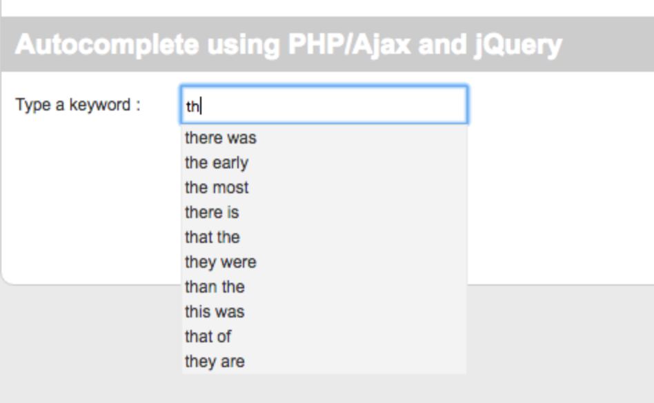

# Content: Auto-Complete
## Project: MapReduce Project - Google Search Auto Complete.

### Preparation

This project requires **MAMP** for macOS machinen and the following is dowload website:

- https://www.mamp.info/en/

set up LAMP(Linux, Apache, MySQL, PHP) for Windows machines.

### Run auto-complete engine

there are tow steps in this project

 First, create offline database and we implement two MapReduce data piplines  

 Second, online visualized data.
 
 First of all, we should get the local configure and make sure it could interact with MapReduce
 
      $ ifconfig | grep inet | grep broadcast #获取本机IP  

Enter MAMP and start the service, check the MySQL running port (3306 )and check the root user and password
Configure MySQL, for create tabe and remote writting data from MapReduce

      #open Terminal 
      $ cd /Applications/MAMP/Library/bin/ 

(mac) ubuntu user enter /usr/local/ammps/sql/bin this path

      $ ./mysql -uroot -p 
      
Then we need to enter password and root user root, the password for ubuntu is musql

      $ create database test;  # create test database 
      $ use test;   # change dataset
      $ create table output(starting_phrase VARCHAR(250), following_word VARCHAR(250), count INT); 
      $ GRANT ALL PRIVILEGES ON *.* TO 'root'@'%' IDENTIFIED BY '**_your-password_** ' WITH GRANT OPTION;   //enable remote data transfer
      $ FLUSH PRIVILEGES
      
Configure Hadoop

      $./start-container.sh # start docker container
      $ ./start-hadoop.sh # start hadoop
      $ cd src # enter hadoop src file
      $ wget https://s3-us-west-2.amazonaws.com/jiuzhang-bigdata/mysql-connector-java-5.1.39-bin.jar
      
Nest we will operate within HDFS file

      $ hdfs dfs -mkdir /mysql # create mysql file within hdfs
      $ hdfs dfs -put mysql-connector-java-*.jar /mysql/  #hdfs path to mysql-connector*
      
Coeficient Modification in order to communicate with local MySQL server
      $ wget  https://s3-us-west-2.amazonaws.com/jiuzhang-bigdata/NGram.tar
      $ tar -xvf NGram.tar
      $ cd NGram
      $ hdfs dfs -mkdir -p input
      $ hdfs dfs -rm -r /output 
      $ hdfs dfs -put bookList/*  input/ 
      $ cd src

open Driver.java and modify following four coeficients

      local_ip_address  : 192.168.1.5
      MySQL_port : 3306 
      your_password: root
      hdfs_path_to_mysql-connector: /mysql/mysql-connector-java-5.1.39-bin.jar

      DBConfiguration.configureDB(conf2,
      "com.mysql.jdbc.Driver", // driver class
      "jdbc:mysql://local_ip_address:MySQL_port/test", // db url
      "root", // user name
      “your_password”); //password
      job2.addArchiveToClassPath(new Path(“hdfs_path_to_mysql-connector”));
      
Run Auto-complete program
      
      $ hadoop com.sun.tools.javac.Main *.java
      $ jar cf ngram.jar *.class
      $ hadoop jar ngram.jar Driver input /output 2 3 4
      
 Run the Auto-Complete User Interface
 
      Put the 'autocomplete-web' file under MAMP file 
      Application -> MAMP -> htdocs
      modify Autocomplete/ajax_refresh.php to local parameter, be carful about the port number
 
Restart the MAMP server
enter browser http://localhost/autocomplete/

the final result show below:

      
      
