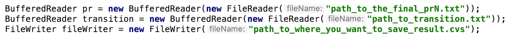

# Content: Auto-Complete
## Project: MapReduce Project - Google Search Auto Complete.

### Preparation

This project requires **MAMP** for macOS machinen and the following is dowload website:

- https://www.mamp.info/en/

set up LAMP(Linux, Apache, MySQL, PHP) for Windows machines.

### Run auto-complete engine

there are tow steps in this project

 First, create offline database and we implement two MapReduce data piplines  

 Second, online visualized data.
 
 First of all, we should get the local configure and make sure it could interact with MapReduce
 
      $ ifconfig | grep inet | grep broadcast #获取本机IP  

Enter MAMP and start the service, check the MySQL running port (3306 )and check the root user and password
Configure MySQL, for create tabe and remote writting data from MapReduce

      #open Terminal 
      $ cd /Applications/MAMP/Library/bin/ 

(mac) ubuntu user enter /usr/local/ammps/sql/bin this path

      $ ./mysql -uroot -p 
      
Then we need to enter password and root user root, the password for ubuntu is musql

      $ create database test;  # create test database 
      $ use test;   # change dataset
      $ create table output(starting_phrase VARCHAR(250), following_word VARCHAR(250), count INT); 
      $ GRANT ALL PRIVILEGES ON *.* TO 'root'@'%' IDENTIFIED BY '**_your-password_** ' WITH GRANT OPTION;   //enable remote data transfer
      $ FLUSH PRIVILEGES
      
Configure Hadoop

      $./start-container.sh # start docker container
      $ ./start-hadoop.sh # start hadoop
      $ cd src # enter hadoop src file
      $ wget https://s3-us-west-2.amazonaws.com/jiuzhang-bigdata/mysql-connector-java-5.1.39-bin.jar
      
Nest we will operate within HDFS file

      $ hdfs dfs -mkdir /mysql # create mysql file within hdfs
      $ hdfs dfs -put mysql-connector-java-*.jar /mysql/  #hdfs path to mysql-connector*
      
Coeficient Modification in order to communicate with local MySQL server
      $ wget  https://s3-us-west-2.amazonaws.com/jiuzhang-bigdata/NGram.tar
      $ tar -xvf NGram.tar
      $ cd NGram
      $ hdfs dfs -mkdir -p input
      $ hdfs dfs -rm -r /output 
      $ hdfs dfs -put bookList/*  input/ 
      $ cd src

open Driver.java and modify following four coeficients

      local_ip_address  : 192.168.1.5
      MySQL_port : 3306 
      your_password: root
      hdfs_path_to_mysql-connector: /mysql/mysql-connector-java-5.1.39-bin.jar

      DBConfiguration.configureDB(conf2,
      "com.mysql.jdbc.Driver", // driver class
      "jdbc:mysql://local_ip_address:MySQL_port/test", // db url
      "root", // user name
      “your_password”); //password
      job2.addArchiveToClassPath(new Path(“hdfs_path_to_mysql-connector”));
      
Run Auto-complete program
      
      $ hadoop com.sun.tools.javac.Main *.java
      $ jar cf ngram.jar *.class
      $ hadoop jar ngram.jar Driver input /output 2 3 4
      
 Run the Auto-Complete User Interface
 
      Put the 'autocomplete-web' file under MAMP file 
      Application -> MAMP -> htdocs
      modify Autocomplete/ajax_refresh.php to local parameter, be carful about the port number
 
Restart the MAMP server
enter browser http://localhost/autocomplete/

the final result show below:

# Content: Web Page Ranking
## Project: MapReduce Project - PageRank.

### Preparation

Data Source: http://www.limfinity.com/ir/

PageRank program running

     cd ~/src # open~/src，
     git clone https://github.com/MinBigData/Project3-1     
     ./start-container.sh # star docker container   
     ./start-hadoop.sh # start hadoop
     
if have root@hadoop-master:#, it means enter docker env

     cd src/main/java/ # 进入project源代码所在的目录
     hdfs dfs -rm -r /transition # 移除hdfs中的/transition目录，如果不存在，该命令会报错，请忽
     hdfs dfs -mkdir /transition # 在hdfs中创建 /transition目录
     hdfs dfs -put transitionsmall.txt /transition # 将transisitonsmall.txt复制到hdfs中的/transition目录下
     hdfs dfs -rm -r /output* # 移除/output目录，不存在该目录会报错，请忽略
     hdfs dfs -rm -r /pagerank* # 移除/pagerank目录
     hdfs dfs -mkdir /pagerank0 #创建/pagerank0目录
     hdfs dfs -put prsmall.txt /pagerank0 #上传PR0
     hadoop com.sun.tools.javac.Main *.java # 编译java源代码

     jar cf pr.jar *.class # 将编译出来的class文件打包成jar包

     hadoop jar pr.jar Driver /transition /pagerank /output 1 运行jar包
     //args0: dir of transition.txt
     //args1: dir of PageRank.txt
     //args2: dir of unitMultiplication result
     //args3: times of convergence（make sure the code run successfully when args3=1, then test args3=40）

the final result will be stored in the /pagerankN file
then we can use 'hdfs dfs -cat /pagerank1/*' to check the result

Generate CSV file and display visualization result
  
     hdfs dfs -get <src> <localDest>
     hdfs dfs -get /pagerank30/part-r-00000 pr30.txt
     
Open Helper.java file，modify the following three parameters to the corresponding path
 parameter1： PRN file path
 parameter2： transition.txt
 parameter3： the result.csv location path
 
 
 
 Page Rank Visualization
 Download the 'pagerank-search' file, which contain the front end code
 
 then unzip and enter the file
   
      tar -xvf pagerank_search.tar
      cd pagerank_search
      

it will generate the result.csv file，and replace the current file
input 'python parse.py' , generate result.json file

input

      python -m SimpleHTTPServer 8000 
      
enter http://localhost:8000 in browser, it will show the user interface, 
User could input some websiteID, for example 1, it will search the pagerank condition near WebsiteID

Following showed the result:

